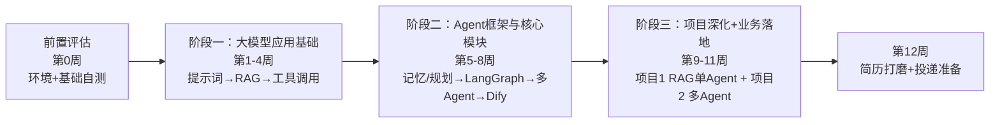

# AI Agent 工程师学习路线（12周总纲）

> 本文档是整套学习计划的**总纲**，回答三个问题：**学什么、按什么顺序学、学到什么程度算过关**。
> 落地执行请配合《Agent工程师每日学习清单》逐日打卡；面试投递请参考本文"简历对标"章节的关键词清单。
>
> **总周期**：12周 ｜ **每周投入**：约15~20小时 ｜ **产出物**：2个可写进简历的完整项目 + 2套版本简历

---

## 一、岗位画像：这两张 JD 在招什么样的人

### 1.1 共性要求（两张 JD 都要求，是必须掌握的能力）

| 能力维度 | 具体要求 |
| --- | --- |
| 编程语言 | Python 为主（类、装饰器、异步、requests、pydantic） |
| 大模型应用 | 大模型调用、提示词工程、RAG、向量数据库 |
| Agent 能力 | Agent 核心模块：**规划、记忆、工具调用（Tool Calling）** |
| 框架 | LangChain / LangGraph / LlamaIndex 等主流框架 |
| 软技能 | 阅读英文技术文档、独立技术调研 |

### 1.2 差异点（两张 JD 的区别，决定简历分版本）

| 对比项 | 岗位1（制造业/半导体方向） | 岗位2（通用 LLM 应用） |
| --- | --- | --- |
| 业务侧重 | 业务落地，偏向制造业/供应链运营场景 | 通用 LLM 应用开发 |
| 重点框架 | **LangGraph、AutoGen、Dify** | **LlamaIndex**、OpenClaw、Hermess |
| 加分项 | 半导体/制造业务知识、知识图谱、专利思路 | 算法基础、技术调研能力 |
| 简历策略 | 版本1：突出制造业业务 Agent 落地 | 版本2：突出通用 LLM 应用与技术调研 |

---

## 二、学习思路总览

整个学习路线遵循一条主线：**先会调用大模型 → 再做 Agent → 再落地项目**，三阶段递进，每阶段都有明确验收标准。

**三阶段的逻辑关系（为什么是这个顺序）：**

1. **阶段一（1-4周）"会用"**：先掌握大模型应用的地基——提示词、RAG、工具调用。没有这一步，后面 Agent 无从谈起（Agent 本质是"大模型 + 工具 + 记忆 + 规划"的组合）。
2. **阶段二（5-8周）"会做"**：把 Agent 三大核心模块（规划、记忆、工具调用）逐一吃透，并用主流框架实现单 Agent、多 Agent 协作。
3. **阶段三（9-11周）"会落地"**：用两个完整项目把前面所有技术串起来，做出能演示、能讲清楚、能写进简历的成果，同时训练面试表达。

---

## 三、前置评估（第0周，约1天）

> 目的：确认起点、补齐基础、搭好环境，避免后面"地基不稳"。

- [ ] 编程基础自测：能否独立写 API 调用、处理 JSON、文件读写？
  - 能 → 直接开始；不能 → 先补 Python 基础 + 简单爬虫
- [ ] 概念扫盲：大模型基础原理、Token、Embedding、向量数据库是什么
- [ ] 环境准备：Python 3.10+、VSCode、Git
- [ ] 模型准备：申请 Qwen / GLM / Kimi API（对应 JD 主流大模型）
- [ ] 向量库：本地装 Chroma / FAISS，了解 Milvus（生产级）
- [ ] 建立 GitHub 仓库，初始化 README（存放全部代码与笔记）

**产出**：可运行的环境 + 一个 GitHub 仓库

---

## 四、阶段一：大模型应用基础（第1~4周）

> **阶段目标**：掌握提示词工程、RAG、向量数据库、Tool Calling，对应 JD 通用能力要求。
> **阶段验收**：能独立搭建 RAG 系统 + 实现单智能体工具调用，看得懂英文官方文档。

| 周次 | 主题 | 核心学习内容 | 实战产出 |
| --- | --- | --- | --- |
| 第1周 | 提示词工程 + LLM API 调用 | Few-shot、CoT 思维链、Self-Consistency、角色设定、结构化输出（JSON）、Prompt 评估；流式输出、错误重试、异步调用、多模型切换 | 通用多模型调用 SDK（强制 JSON 输出） |
| 第2周 | Embedding + 向量数据库 + RAG 基础 | Embedding 原理、文本切分策略（RecursiveCharacterTextSplitter、重叠窗口）；Chroma/FAISS 检索、召回与 Rerank 概念；RAG 完整链路：加载→切分→向量化→检索→拼上下文→回答 | 基础 PDF 文档问答 RAG |
| 第3周 | RAG 进阶 + LangChain 基础 | 查询改写、HyDE、多查询、父文档检索、Rerank 重排、RAG 效果评估；LangChain 核心组件：Document、Chain、Retriever | 优化版 RAG（HyDE + 重排） |
| 第4周 | Tool Calling 工具调用（Agent 核心） | Function Calling 原理、工具定义、参数校验、模型自动选工具、多轮工具调用；LangChain 自定义/内置工具 | 单智能体工具助手（自动调用计算器+搜索） |

### 阶段学习思路

- 第1周的核心是**结构化输出**：AI Agent 的一切下游系统对接都依赖稳定的 JSON 输出，这是最重要的基本功。
- 第2~3周是 **RAG 从"能跑"到"好用"** 的过程：先实现完整链路，再针对幻觉、召回不准确做优化。RAG 是面试最高频考点，务必理解每个环节为什么存在。
- 第4周 **Tool Calling 是 Agent 的灵魂**：学会"模型自主决定何时调用什么工具"，为阶段二铺路。

---

## 五、阶段二：AI Agent 框架与核心模块（第5~8周）

> **阶段目标**：吃透 Agent 三大核心（**规划、记忆、工具调用**），掌握 JD 提到的全部主流框架。
> **阶段验收**：能独立开发单 Agent、多 Agent 协作系统。

| 周次 | 主题 | 核心学习内容 | 实战产出 |
| --- | --- | --- | --- |
| 第5周 | Agent 记忆 + 规划模块 | 短期对话记忆、向量长期记忆、摘要记忆（对应 JD 的 Agent Memory）；ReAct、Plan-and-Solve 任务拆解 | 带长期记忆的 ReAct 智能体 |
| 第6周 | LangGraph（岗位1重点） | 状态机：State、Node、Edge、循环；状态持久化、Human-in-the-loop 人机介入 | LangGraph 复杂任务拆解 Agent |
| 第7周 | AutoGen + LlamaIndex（岗位2重点） | AutoGen 多 Agent 协作、角色分工（Planner/Coder/Reviewer）；LlamaIndex 架构（Query Engine、Agent Engine）与 LangChain 对比 | 多智能体协作任务系统 |
| 第8周 | Dify + 框架调研 | Dify 可视化搭建 RAG/Agent、API 二次开发；调研 OpenClaw、Hermess；对比 LangChain/LangGraph/AutoGen/LlamaIndex | 框架对比调研报告 |

### 阶段学习思路

- 第5周把 Agent 的"软件素质"补齐：**记忆让它记住上下文，规划让它会拆解任务**，这两者加上第4周的工具调用，就是 Agent 的核心。
- 第6周 LangGraph 是岗位1的重点：用状态机把 Agent 流程"工程化"，这是从 Demo 走向业务系统的关键能力。
- 第7周学会**多 Agent 协作**：理解角色分工、消息通信、冲突处理——这是简历里最有含金量的亮点之一。
- 第8周产出**框架对比调研报告**：既是岗位2要求的技术调研能力，也是面试时证明"你懂框架选型"的素材。

---

## 六、阶段三：项目深化 + 业务落地（第9~11周）

> **阶段目标**：做出 2 个可写进简历、可现场演示的完整项目。
> 岗位1 偏制造业运营场景，岗位2 偏通用 LLM 应用，两个项目都覆盖。

### 项目1：企业业务知识库 RAG + 单智能体（两个岗位通用）

- **描述**：企业内部知识库问答 Agent，RAG + 工具调用，支持文档问答、数据计算、报告导出
- **技术栈**：Python、LangChain、Chroma/FAISS、Qwen/GLM、Function Calling
- **亮点**：检索优化降低幻觉、答案溯源（引用原文）、长期记忆、结构化输出

### 项目2：多智能体协作系统（岗位1强加分）

- **描述**：多 Agent 分工协作完成复杂业务流程——规划 Agent 拆任务、检索 Agent 查知识库、工具 Agent 执行、校验 Agent 复核结果
- **技术栈**：Python + LangGraph + AutoGen
- **亮点**：自主决策、多智能体通信、循环纠错机制
- **加分改造**：业务场景换成**制造业/供应链**（物料查询、流程文档问答），贴合岗位1优选专业方向，面试优势极大

### 第11周：面试专项 + 英文文档阅读训练

- **高频面试题整理**：RAG 原理与幻觉优化、Agent 记忆方案、LangGraph 状态机、多智能体协作难点、向量数据库选型、微调 vs RAG、Tool Calling 失败处理
- **英文阅读**：每天读一小段 LangChain / LlamaIndex 官方文档（JD 明确要求）
- **项目复盘**：梳理难点、踩坑点、优化指标，准备 STAR 讲述

---

## 七、第12周：简历打磨 + 投递准备

- **简历项目描述严格对标 JD 关键词**（把关键词原样写进简历）：
  > 大模型、提示词工程、RAG、向量数据库、AI Agent、LangChain、LangGraph、AutoGen、Dify、Tool Calling、Agent Memory、多智能体协作、自主决策 Agent
- **简历分版本**：版本1 侧重制造业业务落地（投岗位1）；版本2 侧重通用 LLM 应用开发（投岗位2）
- **准备 Demo**：GitHub 仓库、README、演示视频，面试现场可展示运行效果

---

## 八、每周最小任务清单（防半途而废的红线）

不管这一周内容多忙，以下三条必须完成，否则视为进度落后：

- [ ] ✅ 每周至少完成 **1 段可运行代码**
- [ ] ✅ **GitHub 持续提交**，记录学习过程
- [ ] ✅ 每周写 **1 篇简短学习笔记**（面试复盘素材）

---

## 九、可选拓展路线（学有余力的加分项）

1. **向量数据库进阶**：Milvus，部署生产环境 RAG
2. **本地大模型部署**：Qwen / Llama3 本地推理，理解端侧/私有化部署
3. **知识图谱**（岗位1提到）：Neo4j + LLM 构建知识图谱问答 Agent
4. **论文与专利**：Agent 顶会论文阅读；尝试写专利思路（岗位1加分）
5. **制造业业务知识**：了解工厂供应链、生产流程，岗位1 面试加分

---

## 附：学习路线速查卡

| 阶段 | 周次 | 一句话目标 | 核心产出 |
| --- | --- | --- | --- |
| 前置 | 第0周 | 搭环境、补基础 | GitHub 仓库 |
| 阶段一 | 1-4周 | 会调用大模型、会做 RAG、会工具调用 | RAG 系统 + 单 Agent |
| 阶段二 | 5-8周 | 会做单/多 Agent 协作 | 多 Agent 系统 + 调研报告 |
| 阶段三 | 9-11周 | 会落地项目 | 2 个简历项目 |
| 收尾 | 第12周 | 会推销自己 | 2 版简历 + Demo |
